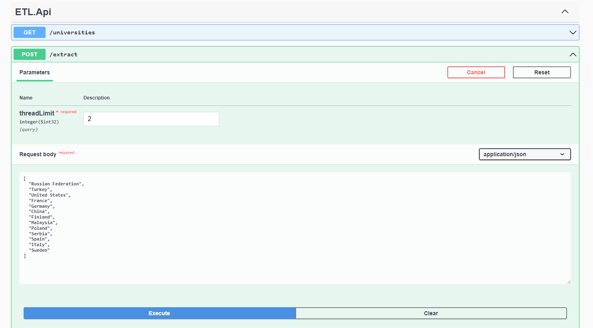

Загрузка данных огранизованна через Controller в API ("/extract").

Применен подход code first. 
Иницализация таблиц SQL выполнится при запуске приложения.

Тестовый набор для загрузки данных: 
[ 
"Russian Federation", 
"Turkey", 
"United States", 
"France", 
"Germany", 
"China", 
"Finland", 
"Malaysia", 
"Poland", 
"Serbia", 
"Spain", 
"Italy", 
"Sweden" 
] 

Пример:
